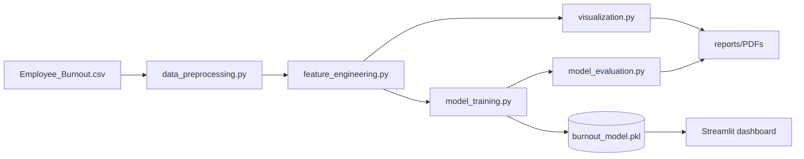

# Employee Burnout Risk Prediction System

An industry-level, end-to-end **HR Analytics** machine learning project that predicts an employee's **burnout risk score (0-100)** from workplace, productivity, and lifestyle factors. Built with a clean, modular architecture, full EDA, a Linear Regression model, professional visualizations, business insights, and a deployable Streamlit dashboard.

---

## Project Overview

Burnout silently erodes productivity, retention, and wellbeing. This project gives HR leaders a data-driven early-warning system: it quantifies burnout risk per employee, explains the drivers in business language, and recommends concrete interventions.

## Business Problem

Organizations lack an objective, repeatable way to identify at-risk employees before burnout leads to absenteeism or attrition. This system models burnout risk from measurable signals so HR can act early and allocate wellbeing resources where they matter most.

## Dataset Description

~1,000 employee records (`Employee_Burnout.csv`). Target: `burnout_risk_score` (0-100).

| Feature | Description |
|---|---|
| `employee_id` | Unique identifier (dropped before modeling) |
| `age` | Employee age |
| `years_experience` | Years of professional experience |
| `weekly_work_hours` | Hours worked per week |
| `meetings_per_week` | Number of meetings per week |
| `emails_sent_per_day` | Emails sent per day |
| `projects_handled` | Concurrent projects |
| `remote_days_per_month` | Remote working days per month |
| `sleep_hours` | Average sleep hours per night |
| `stress_level` | Self-reported stress (scale) |
| `exercise_hours_week` | Exercise hours per week |
| `sick_leaves_year` | Sick leaves taken per year |
| `productivity_score` | Productivity rating |
| `burnout_risk_score` | **Target** burnout risk (0-100) |

> **Data note:** the target is *zero-inflated* (many exact `0.0` values). The EDA and preprocessing explicitly detect and document this, and the reliability report flags when a non-linear model may be warranted.

## Architecture Diagram



## Project Workflow

1. **Load** dataset (auto-detected location + target column).
2. **Engineer** composite features (Workload Index, Health Index, Productivity Efficiency).
3. **Preprocess**: drop IDs, handle missing/duplicates, StandardScaler, 80/20 split (`random_state=42`).
4. **Train** Linear Regression; derive the model equation and coefficient interpretations.
5. **Evaluate**: MAE, MSE, RMSE, R2, Adjusted R2, cross-validation.
6. **Visualize**: EDA + diagnostic plots.
7. **Save** model via pickle.
8. **Report** + **Dashboard** for stakeholders.

## Technologies Used

Python, Pandas, NumPy, Matplotlib, Seaborn, Scikit-Learn, SciPy, Streamlit, fpdf2, Pickle, Jupyter.

## Engineered Features

- **Workload Index** = `weekly_work_hours + meetings_per_week + emails_sent_per_day`
- **Health Index** = `(sleep_hours + exercise_hours_week) / stress_level`
- **Productivity Efficiency** = `productivity_score / weekly_work_hours`

## Model Results & Evaluation Metrics

Generated by `python main.py` into `reports/model_report.txt` and `reports/Model_Report.pdf`:

- Mean Absolute Error (MAE)
- Mean Squared Error (MSE)
- Root Mean Squared Error (RMSE)
- R2 and Adjusted R2
- 5-fold Cross-Validation R2 (mean +/- std)
- Plain-language coefficient interpretation and full model equation

## Visualizations

Saved to `screenshots/`: correlation heatmap, histograms, KDE, boxplots, scatter-vs-target, target distribution, actual-vs-predicted, residual plots, coefficient plot, feature importance.

## Business Insights

See `src/business_insights.py` for risk drivers, protective factors, and **17 actionable HR recommendations** (meeting caps, exercise programmes, work-life balance, flexible work, sleep awareness, stress workshops, and more).

## Dashboard Preview

```bash
streamlit run dashboard/burnout_dashboard.py
```

Pages: **Dataset**, **Charts**, **Risk Calculator** (live prediction), **Model Metrics**, **Business Insights**.

## Installation Guide

```bash
git clone https://gitlab.com/abhilashg869-group/abhilashg869-project.git
cd abhilashg869-project
python -m venv venv && source venv/bin/activate   # Windows: venv\Scripts\activate
pip install -r requirements.txt
```

## Execution Guide

```bash
python main.py                                 # full pipeline -> model + reports + plots
python -m src.report_generator                # build PDF reports
streamlit run dashboard/burnout_dashboard.py  # launch dashboard
```

## Folder Structure

```
.
+-- Employee_Burnout.csv
+-- data/
+-- notebooks/Employee_Burnout_EDA.ipynb
+-- src/
|   +-- data_preprocessing.py
|   +-- feature_engineering.py
|   +-- model_training.py
|   +-- model_evaluation.py
|   +-- visualization.py
|   +-- business_insights.py
|   +-- report_generator.py
+-- models/burnout_model.pkl        # produced by main.py
+-- reports/                        # text + PDF reports
+-- dashboard/burnout_dashboard.py
+-- screenshots/
+-- main.py
+-- requirements.txt
+-- README.md
```

## Future Improvements

- Two-part / Tweedie or gradient-boosting models to handle the zero-inflated target.
- SHAP-based explainability per employee.
- Time-series tracking of burnout trends.
- REST API + containerized deployment.

## Resume Project Description

> **Employee Burnout Risk Prediction System** - Built an end-to-end HR analytics ML pipeline (Python, Scikit-Learn, Streamlit) predicting employee burnout risk from 13+ workplace and lifestyle factors. Engineered composite wellbeing indices, delivered a Linear Regression model with full evaluation (MAE/RMSE/R2/CV), an interactive dashboard with a live risk calculator, automated PDF reporting, and 17 actionable HR recommendations.

## Q & A

**Q: Why Linear Regression for this problem?**
A: It is interpretable - each standardized coefficient maps directly to a business lever, which matters for HR buy-in. We also flag when its linear/zero-bounded assumptions break down.

**Q: The target is zero-inflated. What problems does that cause?**
A: Plain OLS can predict negative values and is biased near the lower bound. We clip predictions to [0,100] and recommend two-part/Tweedie or tree models when R2 is low.

**Q: Why StandardScaler, and why fit only on train?**
A: Scaling makes coefficients comparable across features; fitting on train only prevents data leakage from the test set.

**Q: How do you assess reliability beyond R2?**
A: Adjusted R2 penalizes extra predictors, and 5-fold cross-validation checks stability across data splits.

**Q: How are features engineered and why?**
A: Workload, Health, and Productivity-Efficiency indices combine correlated raw signals into stronger, monitorable KPIs that reduce noise and improve interpretability.

---
